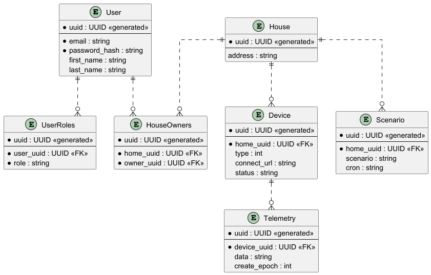

# Smart Home

# Часть 1

## **Задание 1. Анализ и планирование**
Описание расположено в ./smart-home-monolith/Readme.md

## **Задание 2. Проектирование микросервисной архитектуры**
Описание расположено в ./smart-home-to-be/Readme.md

## **Задание 3. Разработка ER-диаграммы**

  

# Часть 2

## **Задание 1. Создание и документирование API**
Описание API в формате OpenAPI 3.0 расположено в ./smart-home-to-be/openapi.yaml

Дедлайн уже наступил, так что необязательные части сделать не успеваю :(
