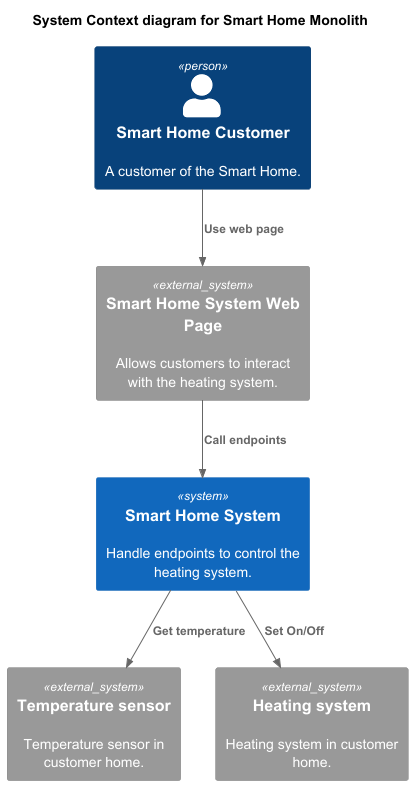

# Smart Home Monolith

## **1. Существующая функциональность монолитного приложения**
**Бизнес функции:**

* **Управление отоплением.** Пользователи могут удалённо включать/выключать отопление в своих домах.
* **Мониторинг температуры.** Система получает данные о температуре с датчиков, установленных в домах. Пользователи могут просматривать текущую температуру в своих домах через веб-интерфейс.

**Эндпоинты:**

* GET "**/{id}**" - Запрос данных о системе отопления: включено, целевая температура, текущая температура
* PUT "**/{id}**" - Включение/выключение и установка целевой температуры в системе отопления
* POST "**/{id}/turn-on**" - Включение системы отопления
* POST "**/{id}/turn-off**" - Выключение системы отопления
* POST "**/{id}/set-temperature**" - Установка целевой температуры в системе отопления (включение и отключение по достижении не реализованы)
* GET "**/{id}/current-temperature**" - Запрос текущей температуры

## **2. Существующая архитектура монолитного приложения**
* Язык программирования: Java
* База данных: PostgreSQL
* Архитектура: Монолитная, все компоненты системы (обработка запросов, бизнес-логика, работа с данными) находятся в рамках одного приложения.
* Взаимодействие: Синхронное, запросы обрабатываются последовательно.
* Масштабируемость: Ограничена, так как монолит сложно масштабировать по частям.
* Развёртывание: Требует остановки всего приложения.

## **3. Домены и границы контекстов монолитного приложения**
**Домены:**

* Управление устройствами
* Телеметрия
* Логгирование

**Контексты:**

* Система отопления
* Сенсор

Классы для сбора телеметрии есть: TemperatureSensor и TemperatureSensorRepository.
Но нужные эндпоинты не реализованы.

## **4. Анализ архитектуры монолитного приложения**
**Существующие проблемы:**

* Отсутствует сервис для работы с пользователями
* Отсутствует сервис для работы с домами
* Отсутствует разделение устройств по типам (сенсор/исполнитель)
* Отсутствует поддержка устройств сторонних производителей
* Отсутствует возможность для пользователей самостоятельного подключения устройств
* Отсутствуют сценарии автоматизации
* Синхронная обработка запросов подходит для сенсоров и исполнителей, но не годится для отчетов по телеметрии за большие периоды времени
* Ограничена возможность масштабирования
* Отсутствует CI/CD-пайплайны
* Отсутствует возможность развертывания обновлений без остановки приложения
* Отсутствует мониторинг
* Логгирование не поддерживает единый формат сообщений
* Параметры конфигурации зашиты в коде приложения

## **5. Визуализация контекста системы**

