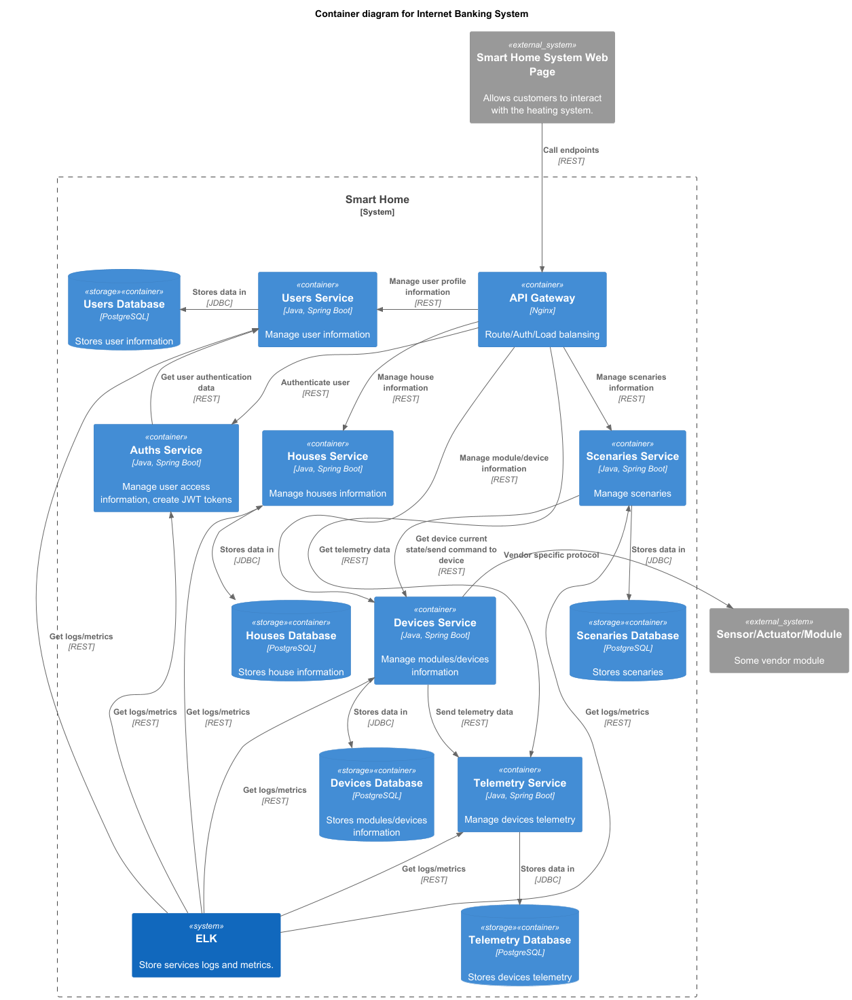

# Smart Home Microservices

# **Задание 2. Проектирование микросервисной архитектуры**

## **1. Декомпозиция приложение на микросервисы**
**Домены:**

* Управление пользователями
* Управление домами
* Управление модулями и устройствами
* Сценарии автоматизации
* Телеметрия
* Логгирование и мониторинг

**Контексты:**

* Пользователи
* Дома
* Модули и устройства
* Сценарии автоматизации
* Телеметрия

**Микросервисы:**

* Управление пользователями
* Аутентификация и авторизация
* Управление домами
* Управление модулями и устройствами
* Управление сценариями автоматизации
* Управление телеметрией

**Контекст системы:**

## **2. Взаимодействия между компонентами**
* Пользователь взаимодействует с системой посредством вэб страницы
* Вэб страница взаимодействует с микросервисами через API Gateway по протоколу REST API
* Микросервис аутентификации получает данные пользователя у микросервиса управления пользователями
* Микросервис телеметрии получает данные у микросервиса управления модулями и устройствами
* Микросервис сценариев получает данные и отправляет команды у микросервиса управление модулями и устройствами
* На каждый микросервис выделяется собственная база данных

## **3. Визуализация архитектуры**
* **C4 — Уровень контейнеров (Containers)**

  
* **C4 — Уровень компонентов (Components)**

* Управление пользователями

  
* Аутентификация и авторизация

  
* Управление домами

  
* Управление модулями и устройствами

  
* Управление сценариями автоматизации

  
* Управление телеметрией

  
* **C4 — Уровень кода (Code)**

* Управление пользователями

  
* Аутентификация и авторизация

  
* Управление домами

  
* Управление модулями и устройствами

  
* Управление сценариями автоматизации

  
* Управление телеметрией

  

# **Задание 3. ER-диаграммы**

## **1. Идентификация сущностей**
* Пользователь - User
* Дом - House
* Устройство - Device
* Сценарий - Scenario
* Запись телеметрии - Telemetry

## **2. Определение атрибутов** 
**User:**
* **uuid** - уникальный идентификатор пользователя.
* **email** - адрес электронной почты пользователя (используется как логин).
* **first_name** - имя пользователя.
* **last_name** - фамилия пользователя.

**House:**
* **uuid** - уникальный идентификатор дома.
* **owner_uuid** - уникальный пользователя, владельца дома.
* **address** - адрес дома.

**Device:**
* **uuid** - уникальный идентификатор устройства.
* **home_uuid** - идентификатор дома, к которому относится устройство.
* **type** - тип устройства.
* **connect_url** - строка подключения к устройству.
* **status** - последнее полученное состояние устройства.

**Scenario:**
* **uuid** - уникальный идентификатор сценария.
* **home_uuid** - идентификатор дома, к которому относится сценарий.
* **scenario** - текст (скрипт JavaScript) сценария
* **cron** - строка в формате cron для запуска сценария по расписанию

**Telemetry:**
* **uuid** - уникальный идентификатор сценария.
* **device_uuid** - идентификатор устройства, с которого получены данные телеметрии.
* **data** - данные телеметрии

## **3. Связи между сущностями**
* **User** — **House**: один пользователь может иметь доступ к нескольким домам, но каждый дом связан только с одним пользователем.
* **House** — **Device**: один дом может содержать несколько устройств, и каждое устройство принадлежит только одному дому.
* **House** — **Scenario**: один дом может содержать несколько сценариев, и каждый сценарий принадлежит только одному дому.
* **Device** — **Telemetry**: одно устройство может создать несколько записей телеметрии, и каждая запись телеметрии принадлежит только одному устройству.
